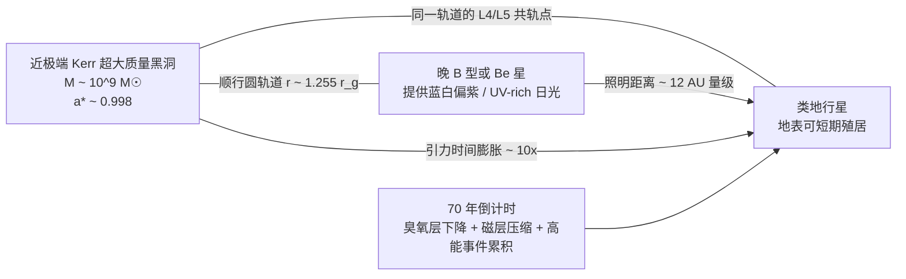

# 面向科幻小说的紫色日光与黑洞时间膨胀科学背景报告

**执行摘要：** 从人眼色觉和恒星连续谱的物理上看，现实中几乎没有“看起来真正为紫色”的**单颗正常恒星**。原因是“紫色”在色度学上属于 CIE 图中的“line of purples”非谱色，而近似黑体的恒星颜色沿 Planckian locus 只会从红、橙、黄白移动到蓝白；温度再高，极限颜色趋向浅蓝，而不是进入“真正紫色”区域。因此，最接近“紫色日光”的真实天体并不是“紫色恒星”，而是**近紫外极强、对人眼呈蓝白或蓝紫偏白**的热 A/B 型恒星，或者**双星混光、发射线增色、行星大气重塑**共同造成的“泛紫环境照明”。已知实在天体里，KELT-9、KELT-20、WASP-33、β Pictoris 一类热 A/B 星系统是最接近候选；但若还要同时满足“行星在约 70 年后因紫色/高能辐射而变得不宜居”以及“行星上 50 年≈外界 500 年”的约 10 倍时间膨胀，最科学的小说方案**不是让行星按常规绕恒星公转**，而是让行星与一颗 UV 丰富的晚 B 型恒星共同围绕一颗近极端自旋的 Kerr 超大质量黑洞做**黑洞共轨特洛伊运动**：黑洞负责时间膨胀，恒星负责“蓝紫偏白”的日光，70 年倒计时则由臭氧层与磁层在持续 XUV/高能粒子输入下坍塌来实现。真正的硬约束是：如果你仍坚持“恒星—行星双体整体贴着黑洞飞”，那么黑洞附近满足 10 倍时间膨胀时，恒星的 Hill 球会小到几乎容不下任何传统宜居轨道。 

## 紫色恒星为何几乎不存在

色度学上，“紫色”不是单一波长的谱色，而是位于 CIE 色度图底边“line of purples”的**混合色**；与此同时，黑体辐射的颜色落在 Planckian locus 上，随着温度升高只会从红移向白、再到蓝白，高温极限也只是浅蓝。这意味着：**正常光球连续谱的单星不会天然看成真正紫色**。如果小说里要写“蓝白偏紫照明星”，最严谨的表述应该是“**带紫感的日光**”“**蓝紫偏白的阳光**”或“**大气与双星混光造成的紫色环境照明**”，而不是“恒星本体就是紫色”。这不是文学妥协，而是色度学和恒星辐射学共同指向的结论。 

从恒星物理上看，温度越高，黑体峰值波长越短；按维恩定律，A、B 级恒星的峰值往往已经落入近紫外。可问题是，人眼看到的不是“峰值波长”，而是**整个可见光带的积分结果**。因此，一颗峰值在 240–390 nm 的热恒星，肉眼通常仍会把它看成**蓝白色**，最多在特定大气条件下显得“冷白偏紫”。这也是为什么最热的真实候选恒星，只能提供“紫味很强的阳光”，却很难提供教科书式的“蓝白偏紫照明星”。 

如果你想把“紫色感”做得更明显，物理上最靠谱的三条路是：其一，用**晚 B/早 A 型主星**提供强近紫外与蓝光；其二，叠加一个**红色次级光源**，把综合色度从 Planckian locus 拉向“紫线”；其三，让行星大气对入射光做光谱整形——例如增强蓝紫散射、削弱中部绿黄带，并在地表材料或高层气溶胶中引入一定的 UV 到紫光再辐射。第一条是真实天文学里确实存在的；第二、第三条更接近你要的小说效果，但目前没有确证的现实实例。 

## 现实候选与理论候选系统

下表把**“最接近紫色日光”的已知系统**和**最适合小说设定的理论模型**放在同一张表里。表中峰值波长均按维恩定律由主星有效温度近似计算，因此应理解为“黑体峰值近似”，不是高分辨光谱测得的精确发光峰。 

| 系统                                                 | 主星光谱型与温度                                                                                   | 近似峰值波长 | 肉眼/地表色感                                                                               |        距离 | 已知行星与关键信息                                                                                                                                          | 与“真正紫色”的差距                                         | 来源                                                                |
| ---------------------------------------------------- | -------------------------------------------------------------------------------------------------- | -----------: | ------------------------------------------------------------------------------------------- | ----------: | ----------------------------------------------------------------------------------------------------------------------------------------------------------- | ------------------------------------------------------------ | ------------------------------------------------------------------- |
| **KELT-9**                                     | B9.5–A0，约 9550–10170 K                                                                         |  285–307 nm | 直视恒星为**蓝白**；地表日光会非常 UV 丰富，可写成“冷白带紫”                        |    204.5 pc | **KELT-9 b**：1.481 d，0.0346 AU，1.89 R_J，2.88 M_J；超高温大气中已探测到 Fe、Fe⁺、Ti⁺                                                             | 峰值太偏近 UV，人眼综合色仍不是“紫”                        | citeturn9view0turn10view0turn31search3                    |
| **KELT-20 / MASCARA-2**                        | A2/A2 V，约 8720–9032 K                                                                           |  321–332 nm | **蓝白**，比太阳冷得多也“更高能”；在特殊大气下可有较强紫感                          |    136.4 pc | **KELT-20 b**：3.474 d，0.0542 AU，1.741 R_J，3.382 M_J；已见 Fe 发射线与强温度逆温                                                                   | 仍是蓝白星，不会天然变成薇蕾斯                                 | citeturn43view0turn42search2turn31search0                 |
| **WASP-33**                                    | A5，约 7400–7430 K                                                                                |       390 nm | 在本表里最靠近可见紫端，但实际视觉仍更像**蓝白偏白**                                  | 约 116.9 pc | **WASP-33 b**：约 1.22 d，约 0.0256 AU，约 1.68 R_J，约 2.1 M_J；有高层逆温与 TiO/短波额外发射证据                                                    | 最接近“可见紫边”，但仍不是非谱色“真正紫”                 | citeturn4view1turn5view0turn31search5                     |
| **β Pictoris**                                | A6 V，约 8052 K                                                                                    |       360 nm | **蓝白**；是很好的“热年轻 A 星照明”现实模板                                         |    19.75 pc | **β Pic b**：23.6 yr，10.018 AU，11.729 M_J，1.65 R_J；**β Pic c**：3.3 yr，2.68 AU，10.139 M_J，1.11 R_J；β Pic b 大气里已检测到 H₂O 与 CO | 紫感不如 KELT-9，但系统细节最适合拿来做“可长期观测的原型”  | citeturn4view2turn34view0turn33view0turn31search6       |
| **理论候选：Kerr 黑洞—晚 B 型星—L4/L5 行星** | 推荐主星：**晚 B 型 / Be 星**，约 11000–13000 K；可选再加红矮星或 Balmer 发射以推向“真紫” |  223–264 nm | 单星版本是**蓝紫偏白**；若叠加红色次级光源或强 Hα/Hβ 发射，可做成更接近“紫色日光” |        未知 | 设定用行星：地球质量，**直接绕黑洞**，与恒星处于同一黑洞轨道的 L4/L5 共轨点                                                                           | 这是最适合你黑洞时间膨胀剧情的结构，但目前没有观测到现实实例 | citeturn26search0turn26search19turn22view0turn20search4 |

把这张表翻译成创作语言，结论可以更直白一些：**真实世界里最接近“紫色阳光”的，不是“紫色恒星”，而是“UV 很足的热 A/B 星 + 有点偏色的大气”**；如果你追求真正的“紫”，则必须让照明从“单一恒星”升级成“**复合光源**”——双星混光、Be 星 Balmer 发射、或者大气再加工。对硬科幻来说，这是优点而不是缺点，因为你可以把“紫感”写成世界观特征，而非一个一查就错的天体颜色。 

在这些现实系统里，**WASP-33**最适合作为“可见紫边缘”的视觉参照，因为按黑体近似它的峰值已压到 390 nm 附近；**KELT-9**和**KELT-20**则更适合作为“UV 冷白/蓝紫偏白”的高能照明原型；**β Pictoris**则是最适合拿来借用“年轻热 A 星系统、重行星、可直接成像”的叙事模板。若小说需要一个“已知现实原型 + 理论强化版”的双层设定，我建议直接写成：**“观测上像 β Pic / KELT-9 的热星，动力学上却是一个贴着 Kerr 黑洞跑的共轨系统。”** 

## 紫色日光对大气化学、生物与七十年宜居性的影响

对类地行星而言，真正危险的往往不是“紫色”这个颜色本身，而是伴随它出现的**高 UV/XUV 通量**。在 Earth-like 大气里，臭氧循环原本就承担了拦截大部分 UV-C 和相当一部分 UV-B 的任务；UV 环境一旦增强，臭氧、氧、NOx 和 HOx 的光化学平衡就会被重写。Rugheimer 等对 Earth-like 行星绕不同宿主星的模型表明：前生命时期的大气如果绕 F0V 恒星运行，其生物学有效辐照可达早期太阳案例的约 6 倍、现代地球—太阳的约 3520 倍，说明**更热、UV 更强的宿主星会极大放大地表生物损伤压力**。与此同时，WHO 也将臭氧层减薄与 UV 增强直接关联到皮肤癌、白内障和免疫系统损伤。 

光合作用层面，问题也仍然是“UV 过量”，而不是“紫色不可用”。可用的光合作用有效辐射（PAR）通常定义在 400–700 nm；地球叶绿素的主要吸收峰本来就在蓝光和红光段，而针对不同恒星的模型还指出，围绕更热恒星进化的光合色素，吸收峰可以更偏向蓝端。因此，在“紫味很重”的阳光下，**经过选育或合成生物学改造的植物并非不能活**；真正困难在于 UV-B/UV-C 会直接打击光系统 II，尤其是水氧化复合体与相关反应中心蛋白，导致光抑制、产量下降乃至系统性失活。 

所以，最可信的“70 年倒计时”不是“70 年内整颗行星大气吹光”，而是**70 年内把地表从‘可短期殖居’变成‘无遮蔽不可居住’**。现有大气逃逸综述指出，XUV 驱动的大尺度大气流失确实会塑造行星长期演化，但它更常见于百万年至十亿年尺度；如果只有 70 年，除非大气本来就极薄，否则“整层大气跑掉”并不是真正硬核的设定。恰恰相反，**臭氧层坍塌、粒子辐射增强、开放地表农业崩溃**，是几十年时间尺度上更科学、也更戏剧化的倒计时。 

你可以把七十年恶化机制写成下面这个物理链条：一个本来就被热 A/B 星强 UV 照亮的类地世界，最初依赖较完整的臭氧层、厚大气和中等磁层勉强维持地表殖居；随后在 70 个本地年内，持续的高能粒子事件与 XUV 增强打破平衡，臭氧柱从类地的约 300 DU 掉到 100 DU 以下，最终逼近或低于 50 DU，地表 UV-B/UV-C 长期越界，无防护农业首先崩溃，随后开放地表的人类活动在医学和工程上变得不再可持续。现有单次强耀发模型表明，没有磁场防护的 Earth-like 行星可在两年后出现高达 94% 的臭氧削弱；重复高能事件模型则显示，反复高能质子事件可在 10 年左右把臭氧层削弱约 94%，并把地表 UV-C 推到持续约 0.1–1 W/m² 的危险水平。把这个数量级放宽到“70 年内缓慢恶化”，在剧情上反而更自然：不需要每年都世界末日，只要每几年一次大事件，殖民地就会眼见着天空越来越毒。 

为了便于写作，下表给出一个**最像硬科幻**的 70 年开倒计时参数窗：

| 机制                     | 建议参数窗                                                                                                    | 70 年后会发生什么                                     | 可信度                                                                                           |
| ------------------------ | ------------------------------------------------------------------------------------------------------------- | ----------------------------------------------------- | ------------------------------------------------------------------------------------------------ |
| **臭氧层慢性坍塌** | 1 bar 左右 Earth-like 大气；持续 UV-rich 背景上再叠加重复高能事件；臭氧柱从 ~300 DU 降到 <100 DU，末期 <50 DU | 开放地表 UV-B/UV-C 失控；露天农业与无遮蔽人类活动终止 | **最高**；与现有耀发-大气模型最接近 citeturn14search2turn16search2turn16search11 |
| **磁层被压扁**     | 恒星风/AGN 风动压提高多个数量级，或行星偶极矩显著走弱；磁层顶长期压缩到接近大气外层                           | 极区粒子沉降增强，NOx/HOx 产率上升，进一步促臭氧破坏  | **中等**；更适合做“加速器”而非唯一主因 citeturn41search9turn16search2            |
| **大气整体逃逸**   | 需要很高且持续的 XUV、且大气本来就薄                                                                          | 70 年内通常难以让 1 bar 大气整体消失                  | **较低**；更适合作为长背景，而非短倒计时主线 citeturn17search0turn17search3        |
| **黑洞环境突变**   | 外界 700 年内 SMBH 从极低吸积率切换到弱活动态，提供新增 XUV/粒子背景                                          | 可把已有的 UV-rich 行星快速推过臭氧崩溃阈值           | **很适合剧情**；但依赖黑洞供给历史设定 citeturn29search8turn29search13             |

工程上，最现实的防护路线是把“行星仍可住”和“**开放地表不再可住**”区分开。按当前 UV 安全规范，广义 actinic UV 的日暴露阈值极低，TLV 级别只有 3 mJ/cm²；换言之，只要臭氧层跌穿关键阈值，地表很快就会从“能晒太阳”退化成“几分钟就出问题”的环境。对殖民地来说，真正可行的是**立刻做强 UV 选择性遮蔽、把农业搬进温室、并将长期人口中心转入地下/厚水体/厚土掩蔽结构**。行星级磁场工程和大气改造都可以写，但更适合做“争论中的大型项目”，而不是 70 年倒计时里真正救场的主武器。大气化学本身的恢复也往往是多年到多年代价巨大的过程，现实地球臭氧恢复就是多年代际问题，而不是几年内修好。 

## 黑洞时间膨胀设定的可行版本

先说最关键的结论：**10 倍时间膨胀做得到，但必须是近极端自旋的 Kerr 超大质量黑洞，而且轨道要在稳定圆轨道极限附近。** 非旋转 Schwarzschild 黑洞的稳定圆轨道外时间膨胀远远不够；要把“行星上 50 年 = 外界 500 年”做成稳定轨道，必须借助 Kerr 黑洞对顺行轨道 ISCO 的压缩。按标准 Kerr 赤道圆轨道关系与 ISCO 半径公式做估算，一个很好用的解是：黑洞自旋参数 **a\* ≈ 0.998**，行星位于**顺行圆轨道半径 r ≈ 1.255 r_g**（这里 \(r_g = GM/c^2\)）。这已经能把远方与本地的时间流逝比拉到约 10:1，同时仍在稳定圆轨道一侧。 

如果把黑洞质量取为 **\(M_{\rm BH} \approx 10^9 M_\odot\)**，则 \(r_g\) 约为 9.87 AU，这个 10 倍时间膨胀轨道的实际半径约 **12.4 AU**。按这一解估算，远方坐标系里轨道周期约 **20.7 小时**，而行星本地固有周期约 **2.1 小时**。更重要的是，潮汐梯度会随着黑洞质量增大而减弱：在这个半径上，若是 \(10^9 M_\odot\) 级超大质量黑洞，类地行星尺度上的差分潮汐加速度仍可压到 **约 0.27 m/s²** 量级；但如果黑洞只有 \(10^8 M_\odot\)，同样几何位置的潮汐差会升到 **约 26 m/s²**，已经高到足以严重威胁类地行星结构稳定。换句话说，**黑洞必须真的“超大质量”**，而不是中等质量黑洞。以上数值是依据标准 Kerr 圆轨道公式和潮汐梯度近似做的估算。 

但这里会冒出一个对硬科幻非常重要、也非常好用的“真问题”：如果你让一颗 2 个太阳质量左右的热 A/B 型恒星与行星一起在黑洞 12.4 AU 处打转，那么这颗恒星的 **Hill 球只有大约 0.011 AU**，也就是百万公里量级。对热 A/B 星来说，这远远小于任何经典宜居轨道。因此，**传统的“行星围着恒星转，而恒星围着黑洞转”几乎不可行**。这不是小修小补能解决的，而是几何级别的不兼容。也正因如此，最科学的改造方案是：**让行星直接绕黑洞运行**，而让恒星与行星处于同一黑洞圆轨道的 L4/L5 共轨位置，由恒星从几十个天文单位内侧向行星提供照明。受限三体问题里，三角拉格朗日点在小质量比条件下本来就是稳定的；近黑洞时广义相对论会修正稳定边界，但并不推翻“\(\mu\ll 0.0385\)”时的基本稳定图景。 

这也直接给出你的最佳小说载体：**Kerr 黑洞—晚 B 型星—L4/L5 类地行星**。如果黑洞轨道半径是 12.4 AU，那么 L4/L5 共轨几何下，恒星与行星的间距也是约 12.4 AU。要在这个距离上给行星接近地球的辐照，恒星光度大约需要到 **150 \(L_\odot\)** 量级；这已经更像**晚 B 型或带发射特征的 Be 星**，而不是 KELT-9 那类光度只有几十 \(L_\odot\) 的 A0 星。这个结论非常适合剧情：你不但得到“更偏紫的日光”，还得到天然更强的 UV 背景与更短的恒星寿命压力。 

黑洞环境风险则可以很清晰地写成三层。第一层是**潮汐撕裂**：通过选 \(10^9 M_\odot\) 级黑洞和近极端顺行轨道，可以把它压到可接受。第二层是**透镜与红移**：轨道上光变、谱线红移/蓝移和视亮度放大会很强，这既是风险也是极好的叙事资源。第三层是最危险的——**吸积盘与活动核**。任何明亮的内吸积盘都会给这个世界带来额外的 XUV、硬 X 射线与粒子风，因此如果你要保住 70 年“暂居期”，最稳妥的设定是一个**目前处于极低吸积率、辐射低效率态的休眠 SMBH**；而在外界 700 年尺度上，它又有能力发生一次“changing-look”式的弱活动回归，把臭氧层真正推下悬崖。这个机制非常“小说友好”，因为它把倒计时与黑洞本体直接绑在了一起。 

下面这张示意图，概括了我认为最适合你小说的动力学版本：

## 固定命名与外界可据以推断黑洞存在的观测特征

当前命名固定为三层：黑洞目录名 `KX-998`；照明星正式名 `BN-7 / Balmer-7`；居住行星正式名 `Violacea / 薇蕾斯`。计划层统一叫“新世界计划 / New World Program”，本作所在分支编号为 `World-IV`。这样既避免“紫色太阳”“暮紫 L5”这类口语称呼，也能让科学线索清楚地落在目录编号和共轨结构上。 

更重要的是观测特征。你完全可以让外界天文学家通过以下几类异常，慢慢拼出“黑洞就在附近”的结论。第一类是**周期性红移/蓝移超常**：像 S0-2 绕银河中心黑洞那样，恒星在近心处出现显著的相对论红移；若你的系统轨道周期只有小时级而主星却像正常晚 B 星，那本身就是“有看不见的巨大引力源”的证据。第二类是**周期性透镜放大与光变尖峰**：早期对极端 Kerr 黑洞附近轨道光源的计算已经显示，黑洞引力聚焦与多普勒效应会让远方观测者看到强烈的相位相关亮度起伏。第三类是**偶发的 X 射线/近红外唤醒**：如果黑洞处于休眠态但偶尔进食，外界会把它先当成“奇怪的核源”或“changing-look AGN”，而行星居民则把它当成真正的末日钟声。 

从叙事技巧上说，最妙的办法不是一开始就说“这里有黑洞”，而是先给读者一些**可反演的天体学症状**：恒星谱线每隔 20 小时就出现强烈红蓝摆动；“太阳”偶尔会在某些季节出现不合常理的亮度尖峰；远方天文学家测得的轨道速度与系统可见质量完全对不上；天空中有弱而不稳定的核红外源；殖民地的历法还要同时记录“本地年”和“外部年”。这样，懂一点天体物理的读者会自己把“黑洞”拼出来，而普通读者也会觉得这些细节非常真。 

## 开放问题与优先参考来源

这份报告里最需要诚实标明的不确定性有三项。第一，**没有任何已确认观测实例**证明存在“对人眼真正呈紫色的单颗恒星”；真实结论是“最接近候选”为热 A/B 星、复合照明或大气重塑。第二，**没有已知现实系统**同时满足“近黑洞 10× 时间膨胀”“热星照明”“可短期类地殖居”。第三，70 年内“完全失去大气”不太可信；**70 年内失去开放地表宜居性**则很可信，尤其是以臭氧层/磁层崩溃为主线时。 

如果你要把这套设定直接写进小说，我的最终建议是：把“蓝白偏紫照明星”写成**“蓝白偏紫的恒星 + 紫调大气光环境”**，把“70 年后不宜居”写成**“地表不再可无遮蔽居住”**，把“近黑洞 10× 时间膨胀”写成**“行星直接绕 Kerr 黑洞运行，恒星在同轨 L4/L5 共轨点供光”**。这三个改写会让你的设定从“概念上很酷”提升为“懂行读者也挑不出大硬伤”。 

**优先参考来源清单：**
KELT-9、KELT-20、β Pictoris 等系统参数优先看 NASA Exoplanet Archive / NASA Exoplanet Catalog。
紫色非谱色与 Planckian locus 的概念，参考 CIE 色度图背景知识与黑体色轨。
不同宿主星下地表 UV 环境，优先看 Rugheimer et al. 2015。 citeturn35view0
光合作用与不同母星光谱协同演化，优先看 Kiang et al. 2007。 citeturn18search8
重复高能事件导致臭氧层长期衰竭，优先看 Segura et al. 2010 与 Tilley et al. 2017。
Kerr 黑洞近地轨道、ISCO 与极端透镜效应，优先看 Bardeen, Press & Teukolsky 1972 及 Cunningham & Bardeen 1972/1973。
黑洞附近相对论红移观测类比，优先看 S0-2/Sgr A* 观测。
吸积态突变与“休眠黑洞重新点亮”的叙事灵感，优先看低吸积率 SMBH 与 changing-look AGN 综述。
